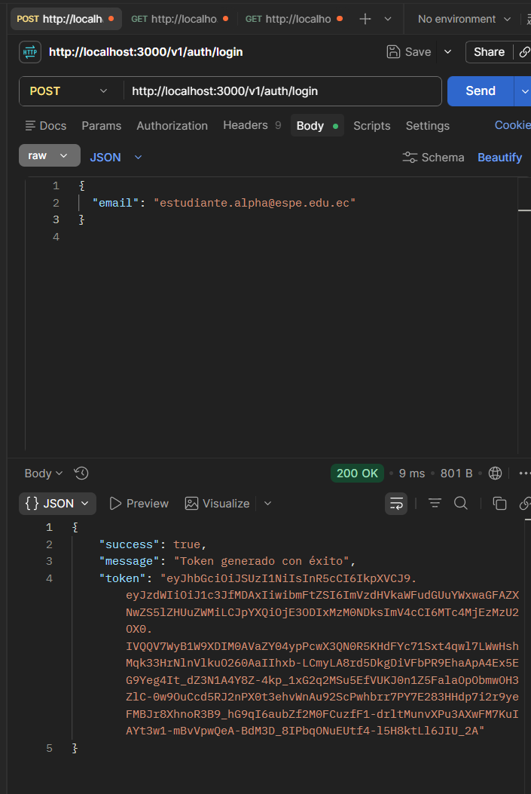
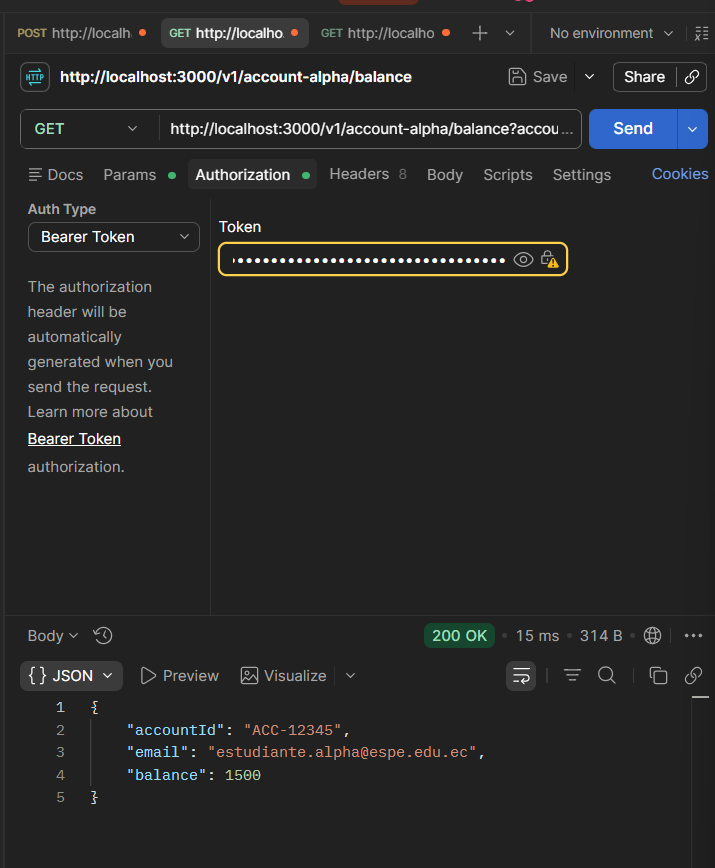
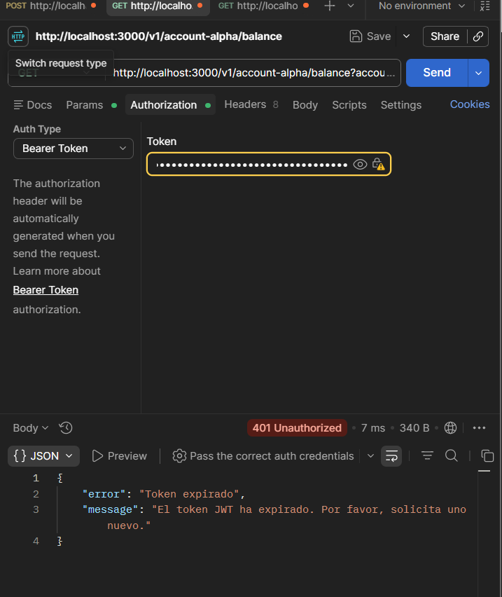
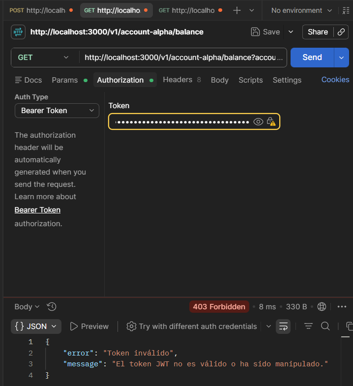
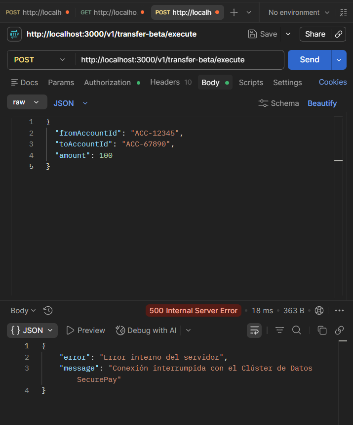
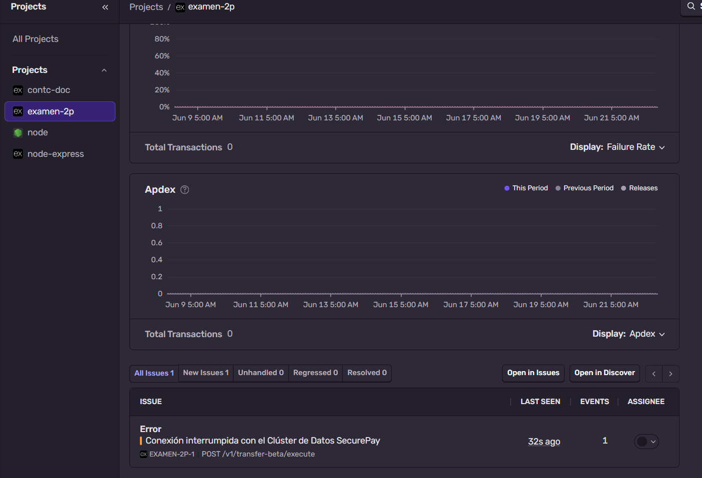
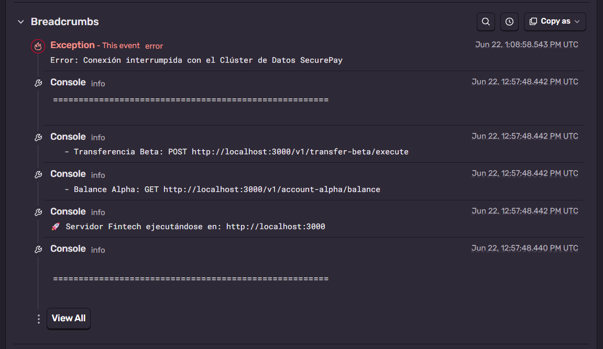
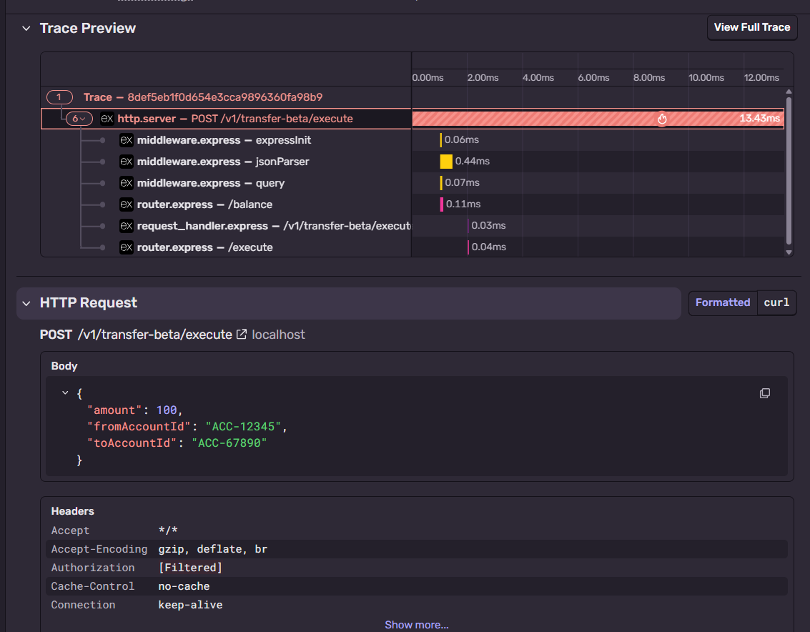
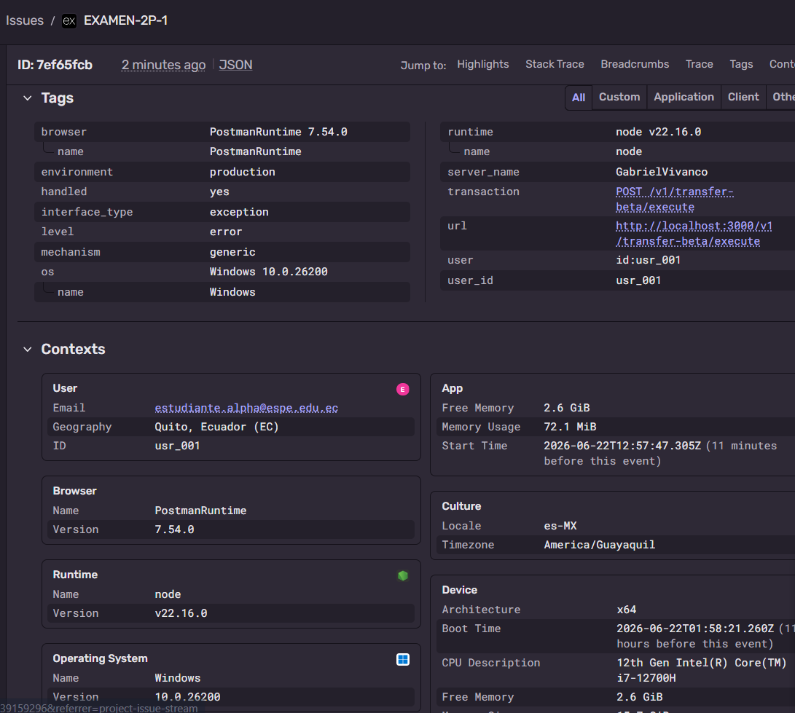

# Examen_Distribuidas_2P

Plataforma de pagos distribuidos SecurePay — Bitácora de evaluación con evidencias de autenticación JWT RS256 y observabilidad con Sentry.

| Rama | Commit |
|------|--------|
| `feature/01-refactor-solid` | `refactor(solid): segregar logica del monolito e inyectar dependencias por constructor` |
| `feature/02-auth-jwt` | `feat(jwt): implementar firmado asimetrico rs256 y middleware de validacion autonoma public-key` |
| `feature/03-observabilidad` | `feat(sentry): instrumentar backend y separar manejo de excepciones logicas 401 de fallos operacionales 500` |

---

## Fase 2 — Autenticación JWT RS256

Generar Token

Acceso Valido

Token Expirado

Token Invalido

---

## Fase 3 — Observabilidad Sentry

Error 500

Dashboard Error Sentry

